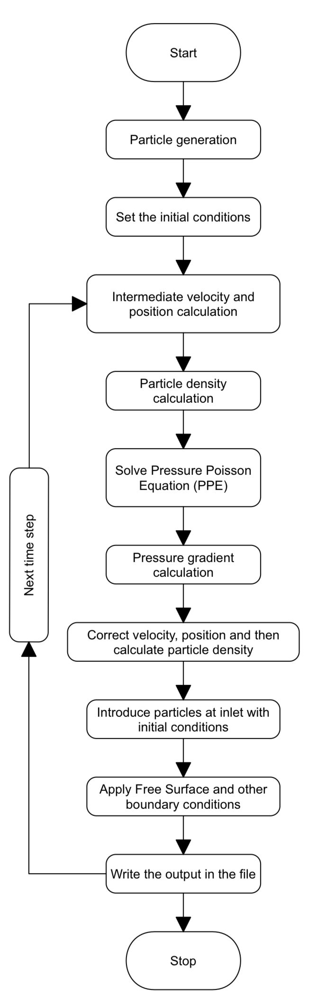
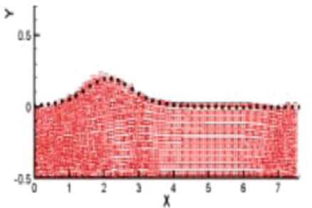
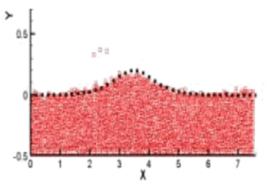
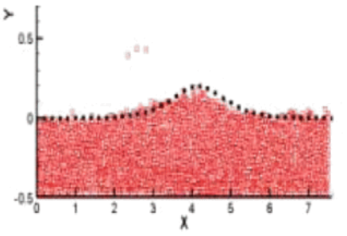
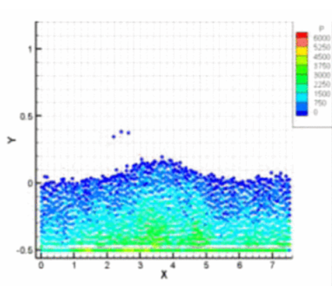

# 2D Wave simulation using Moving Particle Implicit method

## Introduction :
Understanding and accurately predicting the dynamics of water surfaces are essential for designing structures, optimizing coastal defences, and ensuring the safety of maritime activities. In this project, I delved into the realm of numerical methods for fluid simulation, focusing on the Moving Particle Semi-Implicit (MPS) method—a mesh-free approach renowned for its versatility in capturing complex fluid behaviours. 

The MPS method is chosen for its ability to model free surfaces and fluid inter- actions without the constraints of a fixed grid. It employs particles to represent the fluid, enabling the simulation of dynamic free surfaces and fluid flows with greater flexibility than traditional grid-based methods.

The report file gives a detail overiew of the model implementation and using it for simulating different 2D waveforms. It is validated for a 2D solitary wave form against the standard benchmark case found in the literature.

## Program Flow :

## Model Validation :
A 7.5 m channelwith 0.5 m initial water depth has been considered. Particle diameter is considered 0.045 meter and radius of influence of 0.09m. So totally 2496 particles are used in this calculation. The simulation is ran for a time period of 3s with a time step of 0.01s. The wave profiles at t = 0.24s, 0.75s and 1.0s :-

    

Wave profile at t = 0.24s

    

Wave profile at t = 0.75s

    

Wave profile at t = 1.0s

The pressure gradient profile at t=0.81s :-

    

Pressure gradient profile at t = 0.81s

*Pressure gradient profile at t = 0.81s*

